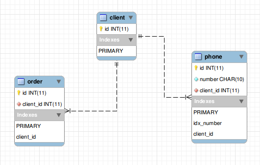

# Задача
http://repetitors.info/job/?programmer2

## Решение


### 1 Извлечение номеров телефонов из текста
Предпосылки:
- Российские номера имеют фиксированный размер в 11 символов
- Номера +7 могут также принадлежать не только РФ, но например и Абхазии. Но предположим, что в этой задаче это не имеет значения
- Если мы распарсили номер длинее 10 символов (без ведущей 8), или короче - это невалидный номер телефона
- Если в середине номера стоят произвольные символы, нехарактерные для номера телефона - это невалидный номер. Пример характерных симовлов: ")", "(", "-"
- В одной строке может быть несколько номеров телефонов. Предположим также, что они могут принадлежать совершенно разным клиентам
- Строка "My phone is 12345678123123123". Можно ли считать это валидным номером телефона? Нет. Это означает, что номера должны быть разделены какими-либо не числовыми символами.
- Человек может писать номер телефон без лидирующих 8 или +7
- Некоторые люди могут писать номер с 7, но без знака +

Напишем конечный автомат, который за линейный проход будет находить телефоны, максимально покрыв его тестами.
Есть два решения:
- Взять регулярные выржения вида: "/(?:(?:8|\+7)[\- ]?)?(?:\(?\d{3}\)?[\- ]?)?[\d\- ]{7,10}/" и модифицировать их, пока тесты не пройдут
- Написать обход строки вручную

Алгоритмически, второй вариант оптимальне. Но, по-скорости вероятно выйграша не будет, т.к. регулярные выражения реализованы на C.
Тем не менее, реализуем второй вариант.

Оформим детектор в отдельный переиспользуемый класс и покроем его тестами.

См. файлы: `lib/phone.class.php` и `tests/phone.class.php`


### 2. База
Предпосылки:
- У одного клиента может быть несколько телефонных номеров и несколько заказов
- Хранить цифру 8 из номера телефона в базе не имеет смысла. Она занимает только лишнее место на диске.
- Хранить номер в int нельзя, т.к. номера могут начинаться с 0
- Задача требует только проверки наличия номера телефона в базе. Поэтому, если речь идет о MySQL, то можно использовать hash indexes.
- Номер телефона в базе уникален. Один телефон - один клиент.

Ниже представлена схема базы.




SQL находится в `etc/db.schema.sql`.


## Запуск
Конфиг находится в `lib/config.php`

Entry point:
```php
./bin/run.php -i "+72631341212"
```
Run tests with phpunit:
```php
phpunit --bootstrap lib/phone.class.php tests/*
```

# Замечания
- Не использовал ORM для простоты, как и не стал выносить работу с базой и поисковик заказов в отдельные классы. Задача была - 2 часа и 2 файла
- Не стал запрашивать все телефоны в одном запросе, т.к. в разумных пределах с хешированным индексом и так будет летать.
- Поскольку дальнейший паттерн использования базы неизвестен (нужны ли например транзакции?), в качестве движка оставим обычный MyISAM, т.к. он быстрее.
- В PHP 7 есть extension с множеством структур данных типа Set, Deque, которые значительно ускорили бы работу программы.
